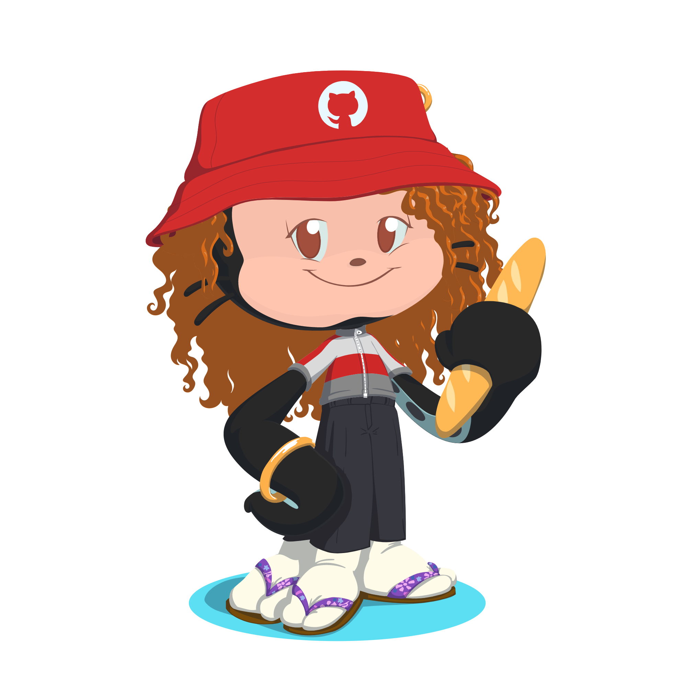

<h1 align="center"> 
 ¡Hola a todos! , soy Mireya . 
 </h1>

### Soy estudiante de segundo curso de DAM 👩🏻‍💻 ([Desarrollo de Aplicaciones Multiplataforma][website3]) en el [IES Luis Vives 🏫 .][website4]

<h2 align="center"> 📖 Un poco sobre mi historia: </h2>

Hace unos años comencé el primer año de [Ingeniería Telemática][website1] en la [UC3M][website2] y, según fue trascurriendo el primer curso, me fui interesando cada vez más en el terreno de la programación. 

Es aquí cuando comencé a plantearme cambiar mi camino, y con ello mi futuro profesional. Inicie el grado superior de [Desarrollo de Aplicaciones Multiplataforma][website3] en el [IES Luis Vives][website4]. Pese que al principio de este nuevo cambio estaba un tanto dudosa, a día de hoy puedo estar totalmente segura de decir que es mi principal interés profesional.

Estoy interesada en invetigar y aprender sobre nuevas tecnologías y por lo tanto los recursos que estas me pueden ofrecer.

<h2 align="center"> 👀 Sobre mi conocimientos: </h2>

En mi perfil encontrarás de principio a fin el desarrollo de mis estudios. Tanto mis primeras pruebas personales, como trabajos individuales y en grupo propuestos por mis profesores.

> #### Actualmente estoy aprendiendo los siguientes lenguajes de programación:
>
>  &nbsp;&nbsp;
 &nbsp;&nbsp; 
 &nbsp;&nbsp; 
 &nbsp;&nbsp;

> #### Y algunas de las tecnologías que estoy aprendiendo a utilizar son:
>
> &nbsp;&nbsp;
&nbsp;&nbsp;
&nbsp;&nbsp;
&nbsp;&nbsp;
 &nbsp;&nbsp;

## <h2 align="center"> 📫 Contacto: 
> - <mireyasancz02@gmail.com>
>
> - <mireya.sanchez@alumno.iesluisvives.org>
> 
> - <https://www.linkedin.com/in/mireya-s%C3%A1nchez-pinz%C3%B3n-676b86224/>

<!-- Enlaces -->
[website1]:https://www.uc3m.es/grado/telematica
[website2]:https://www.uc3m.es/inicio
[website3]:https://www.iesluisvives.es/default.aspx?tabid=43636&rowid=1687109,87592
[website4]: http://iesluisvives.es/

  
  
 <h1 align="center"> 
 👋🏻  ¡Hasta pronto! 👋🏻 
 </h1>
 
