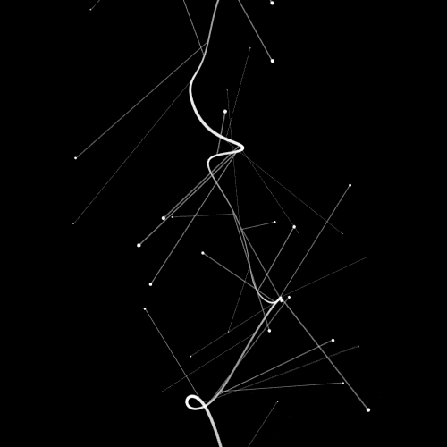

### <h1 align="center">¡Hola!, soy Mireya.</h1>

 En mi perfil encontrarás el desarrollo de mis estudios. Tanto pruebas personales como proyectos propuestos por profesores.
  

  
#### <h3 align="center"> Lenguajes </h3>

   &nbsp; 
   &nbsp; 
   &nbsp; 
   &nbsp; 
   &nbsp; 
   &nbsp; 
   &nbsp; 
   &nbsp; 
   &nbsp; 

 

#### <h3 align="center"> Tecnologías </h3>

   &nbsp; 
   &nbsp; 
   &nbsp;
   &nbsp;
   &nbsp;
   &nbsp;
   &nbsp;
   &nbsp; 
   &nbsp; 
   &nbsp;
   &nbsp; 
   &nbsp; 
   &nbsp;
   &nbsp;
   &nbsp;
   &nbsp; 
   &nbsp;
   &nbsp;
   &nbsp;
   &nbsp; 
   &nbsp; 
   &nbsp; 
   &nbsp; 
   &nbsp; 
   &nbsp; 

   

 
 

####  <h3 align="center"> Entornos </h3>

   &nbsp; 
   &nbsp;
   &nbsp;
   &nbsp; 
   &nbsp; 
   &nbsp; 
   &nbsp; 
   &nbsp; 
   &nbsp; 
   &nbsp;
   &nbsp;
   
   &nbsp;
   &nbsp;

 
 

## <h2 align="center"> Contacto  
> - <mireyasancz02@gmail.com>
> 
> - <https://www.linkedin.com/in/mireyasanchz/>

## <h1 align="center"> 
 ¡Gracias! 
 </h1>
 
